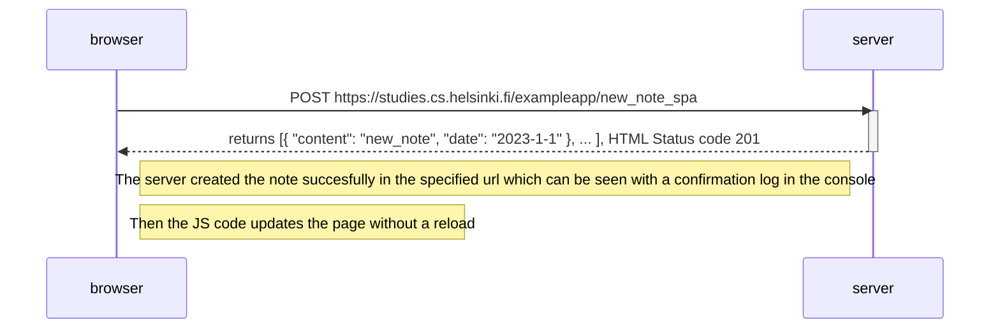

```mermaid
sequenceDiagram
    participant browser
    participant server

    browser->>server: POST https://studies.cs.helsinki.fi/exampleapp/new_note_spa
    activate server
    server-->>browser: returns [{ "content": "new_note", "date": "2023-1-1" }, ... ], HTML Status code 201
    deactivate server

    Note left of server: The server created the note succesfully in the specified url which can be seen with a confirmation log in the console
    
    Note right of browser: Then the JS code updates the page without a reload
```